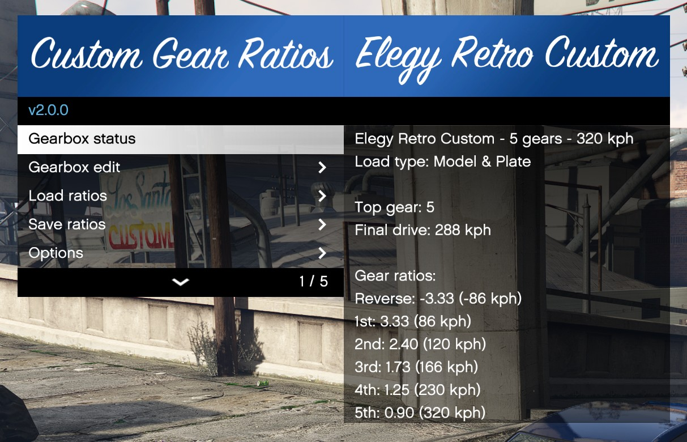

# Custom Gear Ratios
{:.no_toc}

Change car gear ratios in GTA V.



<a href="https://github.com/ikt32/scripts-updates/releases?q=%22Custom+Gear+Ratios%22"
   target="_blank"
   class="download-button"
   title="View and download all releases on GitHub">📥Releases</a>

* ToC Placeholder
{:toc}

## Requirements

* Grand Theft Auto V
* [ScriptHookV](http://www.dev-c.com/gtav/scripthookv)
* A valid license [(Patreon)](https://www.patreon.com/ikt)

### Activation

A license is required to use Custom Gear Ratios v1.2.1 and newer.
You can get one by pledging on [Patreon](https://www.patreon.com/ikt).
The script will inform you when you need to generate or renew the license.

## Installation

1. Put `CustomGearRatios.asi` and the folder `CustomGearRatios` in your GTA V folder.
2. Start the game.

### Updating

Put `CustomGearRatios.asi` in your GTA V folder.
Old settings don't need to be replaced.

## Usage

To open the menu:

* Press F8, or
* Enter the "cgr" cheat in the cheat window (tilde (~)).

The key and cheat to open the menu can be changed in settings_menu.ini.

## XML files

In the folder `CustomGearRatios/Configs`, XML files can be placed with gearbox descriptions.

Layout:

```xml
<?xml version="1.0"?>
<Vehicle>
    <Description>5-gear AE86</Description>
    <ModelName>Futo</ModelName>
    <PlateText>undefined</PlateText>
    <TopGear>5</TopGear>
    <DriveMaxVel>48.07</DriveMaxVel>
    <Gear0>-3.484</Gear0>
    <Gear1>3.587</Gear1>
    <Gear2>2.022</Gear2>
    <Gear3>1.384</Gear3>
    <Gear4>1.000</Gear4>
    <Gear5>0.861</Gear5>
</Vehicle>
```

* File name: Must end with .xml
* Description: In-game in-menu displayed name of the configuration
* `ModelName`: Used to match the vehicle model for auto-loading
* `PlateText`:
  * `autoload_model`: Loads the config for all vehicles with this model.
  * `undefined`: Doesn't automatically load the config.
  * Any other string: Matches the plate text to only load for specific model + plate combinations.
* `DriveMaxVel`: In m/s. More or less the final drive modifier.
* `Gear{X}`: Actual gear ratio for that gear
  * When not enough gears are provided for the `TopGear`, the config is invalid and will not load.
* Note that starting with v2.0, CVT parameters are also added.

## Notes

Gear ratios are changed by the gearbox tuning and other scripts that call `MODIFY_VEHICLE_TOP_SPEED`.
The script tries to revert back to the gearbox settings before this,
but it's recommended to disable all functionalities in scripts that modify the top speed using the mentioned native.
