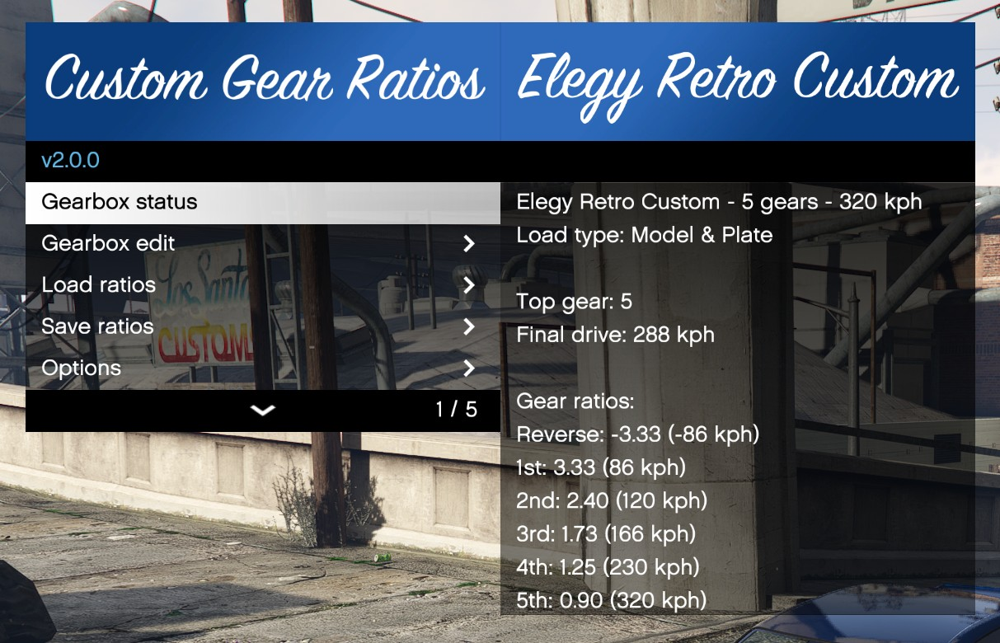

# Custom Gear Ratios
{:.no_toc}

Change car gear ratios in GTA V.



<a href="https://github.com/ikt32/scripts-updates/releases?q=%22Custom+Gear+Ratios%22"
   target="_blank"
   class="download-button"
   title="View and download all releases on GitHub">📥Releases</a>

* ToC Placeholder
{:toc}

## Requirements

* Grand Theft Auto V
* [ScriptHookV](http://www.dev-c.com/gtav/scripthookv)

## Installation

1. Put `CustomGearRatios.asi` and the folder `CustomGearRatios` in your GTA V folder.
2. Start the game.

### Updating

Put `CustomGearRatios.asi` in your GTA V folder.
Old settings don't need to be replaced.

## Usage

To open the menu:

* Press F8, or
* Enter the "cgr" cheat in the cheat window (tilde (~)).

The key and cheat to open the menu can be changed in settings_menu.ini.

## XML files

In the folder `CustomGearRatios/Configs`, XML files can be placed with gearbox descriptions.

Layout:

```xml
<?xml version="1.0"?>
<Vehicle>
    <Description>5-gear AE86</Description>
    <ModelName>Futo</ModelName>
    <PlateText>undefined</PlateText>
    <TopGear>5</TopGear>
    <DriveMaxVel>48.07</DriveMaxVel>
    <Gear0>-3.484</Gear0>
    <Gear1>3.587</Gear1>
    <Gear2>2.022</Gear2>
    <Gear3>1.384</Gear3>
    <Gear4>1.000</Gear4>
    <Gear5>0.861</Gear5>
    <CVT.Enable>false</CVT.Enable>
    <CVT.LowRatio>3.3</CVT.LowRatio>
    <CVT.HighRatio>0.9</CVT.HighRatio>
    <CVT.RPMTarget>0.80</CVT.RPMTarget>
    <CVT.ShiftUpSpeed>4.0</CVT.ShiftUpSpeed>
    <CVT.ShiftDownSpeed>8.0</CVT.ShiftDownSpeed>
    <CVT.LoadResponseRate>2.0</CVT.LoadResponseRate>
</Vehicle>
```

* File name: Must end with .xml
* Description: In-game in-menu displayed name of the configuration
* `ModelName`: Used to match the vehicle model for auto-loading
* `PlateText`:
  * `autoload_model`: Loads the config for all vehicles with this model.
  * `undefined`: Doesn't automatically load the config.
  * Any other string: Matches the plate text to only load for specific model + plate combinations.
* `DriveMaxVel`: In m/s. More or less the final drive modifier.
* `Gear{X}`: Actual gear ratio for that gear
  * When not enough gears are provided for the `TopGear`, the config is invalid and will not load.
* `CVT.Enable`: Only used when `TopGear` is `1`. Simulates a CVT instead of a single fixed gear.
* `CVT.LowRatio`: Ratio at the low end of the range, essentially "first gear".
* `CVT.HighRatio`: Ratio at the high end of the range, essentially "top gear".
* `CVT.RPMTarget`: Relative RPM (0-1) the CVT aims for at full throttle, i.e. where the engine makes peak power.
* `CVT.ShiftUpSpeed`: How fast the CVT can move through its full ratio range when upshifting. `1.0` ≈ 1s, `5.0` ≈ 0.2s, `10.0` ≈ 0.1s.
* `CVT.ShiftDownSpeed`: Same as above, but for downshifting. Usually higher than `CVTShiftUpSpeed`.
* `CVT.LoadResponseRate`: How quickly the simulated engine RPM catches up to the CVT's target ratio. Higher is more responsive.
* Note that starting with release 2.0.0, CVT parameters are also added.

## CVT (Continuously Variable Transmission)

When a configuration has `TopGear` set to `1` and `CVT.Enable` set to `true`, the script simulates a CVT
instead of using a single fixed gear ratio.

Instead of shifting between fixed gears, the ratio is continuously adjusted between `CVT.LowRatio` and
`CVT.HighRatio` based on throttle input and vehicle speed.

With release 2.1.0, CVT has been overhauled and gained additional parameters:
`CVT.Factor` is replaced, direct RPM target now set by `CVT.RPMTarget`.
`CVT.ShiftUpSpeed` and `CVT.ShiftDownSpeed` control how quickly the ratio can change, and
`CVT.LoadResponseRate` simulates engine loading so the RPM doesn't jump to its target instantly.

These parameters can also be tweaked in-game through the menu, when the active configuration has
`TopGear` set to `1` and CVT is enabled.

## Notes

Gear ratios are changed by the gearbox tuning and other scripts that call `MODIFY_VEHICLE_TOP_SPEED`.
The script tries to revert back to the gearbox settings before this,
but it's recommended to disable all functionalities in scripts that modify the top speed using the mentioned native.
