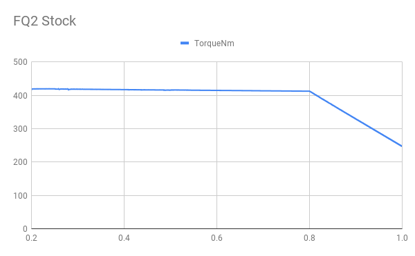
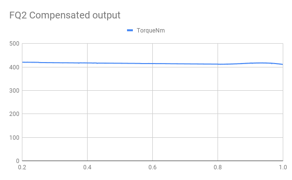
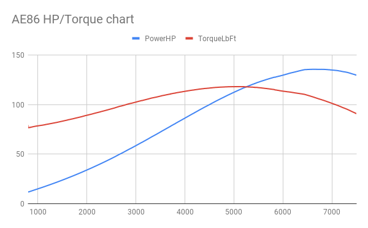

# Custom Torque Map
{:.no_toc}

GTA V simulates a decent amount of realism in car behaviour, but the engine chacteristics are dead simple and
identical for nearly all cars.
causing nearly every vehicle to drive the same. Custom Torque Map allows handling creators to create realistic and
accurate-to-life engine responses.


(Engine torque map and generated info as visualized in-game by the script)

[<span style="font-size:2em;">📥 Releases</span>](https://github.com/ikt32/scripts-updates/releases?q=%22Custom+Torque+Map%22)

* ToC Placeholder
{:toc}

## Features

* Define completely custom engine torque curves
* Supports torque maps with any amount of data points
* Supports NPC vehicles
* Compatible with engine tuning
* Calculates and visualizes engine power and torque values
* Export power and torque data to csv for analyzing
* Unique [Nissan 300ZX Turbo](https://www.youtube.com/watch?v=xGmNuuoyiYQ) inspired tachometer

## Requirements

* Grand Theft Auto V
* [ScriptHookV](http://www.dev-c.com/gtav/scripthookv)
* A valid license [(Patreon)](https://www.patreon.com/ikt)

### Activation

A license is required to use Custom Gear Ratios v1.2.1 and newer.
You can get one by pledging on [Patreon](https://www.patreon.com/ikt).
The script will inform you when you need to generate or renew the license.

## Installation

1. Put `CustomTorqueMap.asi` and the folder `CustomTorqueMap` in the GTA V folder.
2. Start the game

## Usage

Torque maps go into the `Configs` folder, and are automatically loaded when the model matches,
or the model **and** plate match.

Open the management menu with the `ctm` cheat (use tilde (`~`) to open the cheat console).
Other hotkeys may be assigned in `settings_menu.ini`.

## Configuration files

Configuration files are to be placed in the `Configs` folder. These are the things to pay attention to:

File name: Anything goes, as long as it ends on `.ini`.
The file name without the extension is used as "Name" in the script.

`handling.meta`:

* `fMass` is used to calculate torque (N⋅m or lb⋅ft).
* `fInitialDriveForce` is the base value of the map, the final output is multiplied with this base value.

Tuning: Vehicle mods, such as engine upgrades and turbo, will impact performance final output.

```ini
[ID]
; Model name of vehicles this configuration applies for.
ModelName = r32

; Optional: Hash of model name.
; Only used if specified, may be omitted entirely.
ModelHash = 0x8C34D838

; Optional: License plate this configuration applies for.
; If both model and plate match, the plate variant of the configuration is prioritized.
; Only used if specified, may be omitted entirely.
Plate = 46EEK572

[Data]
; IdleRPM and RevLimitRPM are optional. These values are used to calculate horsepower and actual RPM.

; RPM the engine idles at.
; Corresponds to 0.2 normalized RPM.
IdleRPM = 800

; RPM of the rev limiter.
; Corresponds to 1.0 normalized RPM.
RevLimitRPM = 8000

; Torque map. Do not touch the END_OF_MAP lines, these are used to determine the begin and end of the map.
; The map is defined as {normalized_rpm}|{normalized_torque}.
; At least three data points are required. There is no upper limit.
; normalized_rpm: RPM as ratio between idle and rev limit.
;                 0.2 RPM is idle, 1.0 RPM is rev limit.
;                 Use "NormalizedRPM = (RPM - IdleRPM) * (1.0 - 0.2) / (RevLimitRPM - IdleRPM) + 0.2"
;                 to map from real RPM to normalized RPM.
; normalized_torque: Torque as ratio of max torque.
;                 Use "NormalizedTorque = Torque / MaxTorque"
;                 to map from real torque to normalized torque.
;--------------------------------------------------------------
; Note for 1.0.2:
; Using actual dyno data is valid since 1.0.2.
; The map in 1.0.2 also supports {actual_rpm}|{actual_torque}.
; The script normalizes both RPM and torque, so input units don't matter.
; It's activated when the first RPM item is higher than 1, such as 800 (RPM).
; Make sure the top (last) RPM value is the redline value.
; If it's not in your data set, just pick a reasonable number.
TorqueMultMap = <<<END_OF_MAP
0.222|0.612
0.278|0.718
0.333|0.776
0.444|0.898
0.556|0.939
0.667|0.980
0.689|1.000
0.778|0.955
0.867|0.918
0.911|0.816
END_OF_MAP
```

For more pre-made configs, check [TheAdmiester's repository on GitHub](https://github.com/AJB-Tech/GTATorqueMaps).

## Background

GTA V actually simulates a decent amount of realism in vehicle behavior, but the default and hard-coded configurations
are rather basic or set up for arcade gameplay. Engine behavior is one of these components.

### GTA V's simplification

In a real car, every engine behaves differently throughout its RPM range, further changed by forced induction. In the
game, this is all flattened. Every engine has the exact same torque curve and resulting power curve: flat max torque
until 80% of the rev limit, then it tapers off to 60% of the max torque at the rev limit. Horsepower peaks at 80% RPM.
Except the first gear, which always offers full torque.

This causes every vehicle to feel similar during acceleration, even with varying amounts of `fInitialDriveForce` and
`fInitialDragCoeff` in the handling definitions, because the acceleration is always linear.

The following image shows the power output at the wheels of an FQ2, with data taken from a real in-game acceleration
test:



It can be seen that the output is a perfect straight line of maximum torque, all the way to 80% of the max RPM, and
then linearly tapers off to 60% of the max torque at the rev limit.

CTM (Custom Torque Map) changes the torque output live to match the behavior of any engine throughout its RPM range.
To achieve this, CTM pre-processes normalizes the default output map before applying the custom torque map:



### Power figures, and other assumptions

In `handling.meta`, the `fInitialDriveForce` and `fMass` fields are relevant to torque and power calculation.

As a specific `fInitialDriveForce` results in the same acceleration for vehicles with wildly different weights,
it can be inferred that `fInitialDriveForce * fMass` results in some actual power/torque number. Experimental results
have shown that doing exactly that (and tweaking `fInitialDragCoeff`) results in acceleration consistent with real cars,
if the result of `fInitialDriveForce * fMass` is assumed to be in **Torque in N⋅m**. Units in the game are in metric,
so this conversion and assumption should be plausible.

### Power

The formula to calculate power from a rotating system (e.g. vehicle wheels) is `torque * rotationSpeed`. Torque can
be calculated using the fInitialDriveForce and vehicle weight.

The correct torque value is known, as described above. The *engine* rotation speed however, is unknown.
The game does not seem to have a definition of engine speed, as internal game data only uses engine speed as a ratio
of 0.2 (idle) to 1.0 (rev limit).

While the game does specify gear ratios, and dimensions of the wheel-tire combination are available, the final drive
ratio doesn't seem to exist as of the latest research. The only link seems to be `fInitialDriveMaxFlatVel`, but
that still abstracts too much to say anything definite about the engine rotation speed.

This is why `IdleRPM` and `RevLimitRPM` are required in the configuration files in order to make a calculation of
power. While there are no gameplay impacts if these values miss, the script can't calculate out the output power.

The game lacks any definition of real engine speed, and it cannot be deduced from gearing data alone.
Power figures (horsepower and kilowatts) thus rely on the `IdleRPM` and `RevLimitRPM` being defined in the
configuration files.

Numbers displayed in-game are measured at the wheel. These numbers are affected by throttle input, terrain,
how much the wheel sinks into the terrain, engine tuning level, and the presence of the turbo mod.
Additionally, scripts that alter power also affect this final torque.

## Data logging

The script includes a function to record the actual torque and power output. The format is `{timestamp}-{model}.csv`,
and any software such as Microsoft Excel or Google Sheets can be used to import this file to process the output.
An example of visualized data is this following graph:



Columns:

* NormalizedRPM: RPM between idle (0.2) and max (1.0)
* RealRPM: "Real" RPM, from NormalizedRPM mapped onto the IdleRPM and RevLimitRPM range
* PowerkW: Engine power output in kW. Requires IdleRPM and RevLimitRPM presence.
* PowerHP: Engine power output in HP. Requires IdleRPM and RevLimitRPM presence.
* TorqueNm: Engine torque output in N⋅m. Calculated from actual output force and handling `fMass`.
* TorqueLbFt: Engine torque output in lbf⋅ft. Calculated from actual output force and handling `fMass`.
* TorqueMapNm: Mapped engine torque output in N⋅m. Calculated from mapped force and handling `fMass`.

The difference between `TorqueMapNm` and `TorqueNm` can be used to determine the effect of various in-game vehicle
mods.

* `TorqueMapNm` is the base expected output if no vehicle mods are applied, or scripts are active.
* `TorqueNm` is the actual output, affected by vehicle mods and scripts.

## Open issues

Compensation for power loss is not perfect. As shown in the figure with the linearized FQ2 map, there
is a slight wobble. Help to get this perfect would be great.

The current solution:

```cpp
    const std::map<float, float> BaseTorqueModMap1 {
        { 0.0f, 0.0f },
        { 0.8f, 0.0f },
        { 1.0f, 0.4f },
    };
    const std::map<float, float> BaseTorqueModMap2{
        { 0.0f, 0.0f },
        { 0.8f, 0.0f },
        { 1.0f, 2.0f/3.0f },
    };

    float rpm = VExt::GetCurrentRPM(mVehicle);

    // GetScaledValue returns an interpolated value from the map, e.g. at 0.9 RPM, 0.2 is returned.
    float baseMod1 = CustomTorque::GetScaledValue(BaseTorqueModMap1, rpm) * baseDriveForce;
    float baseMod2 = CustomTorque::GetScaledValue(BaseTorqueModMap2, rpm) * baseDriveForce;

    // map maps the input value (rpm) from its own range (0.8, 1.0) to another range (baseMod1/2).
    float baseMod = map(rpm, 0.8f, 1.0f, baseMod1, baseMod2);

    if (rpm <= 0.8f)
        baseMod = 0.0f;

    float finalForce = (baseDriveForce + baseMod);
```

## Special Thanks

Thanks to the following people, who helped with making this script come together:

* TheAdmiester, for providing lots of data and testing
* Members of GVMA, for testing and general involvement
