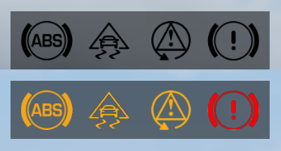

# Manual Transmission
{:.no_toc}

Expands the driving immersion and experience in Grand Theft Auto V, with wheel support, manual transmission,
advanced transmission settings, advanced steering settings, configurable assists and much more.

[📥 Releases](https://github.com/ikt32/scripts-updates/releases?q=%22Manual+Transmission%22)

* ToC Placeholder
{:toc}

## Features

* Complete steering wheel support
  * DirectInput interfacing
  * Force feedback from scratch
  * Multiple devices supported
* Transmission replacement with custom modes and more
  * Manual sequential
  * Manual H-pattern
  * Custom Automatic
  * Working clutch
  * Engine braking/stalling/damage
* Tunable driving assists
  * Launch control
  * Traction control
  * Stability control
  * Custom anti-lock braking
* Synchronized steering wheel and animations
  * Match your actual wheel 1:1
  * First person hand-over-hand animations
* Seamless input switching between steering wheel, gamepad and keyboard
* Complete in-game configuration menu
* Vehicle-specific configurations
* Customizable steering assists
* Expose UDP telemetry (DiRT 4 format) for motion platforms, dashboard apps and more

### Recommended mods

For gameplay and driving:

* A realistic handling mod
* [Custom Gear Ratios](https://github.com/ikt32/scripts-updates/blob/master/5-cgr-readme.md): Essential if you have cars with more than 6 gears, and allows matching gear ratios with the real car counterparts.
* [Turbo Fix](https://github.com/ikt32/scripts-updates/blob/master/5-turbofix-readme.md): Fixes spool rates of the turbo upgrade.
* [Dial Accuracy Fix](https://www.gta5-mods.com/scripts/dial-accuracy-fix): Remap dashboard dials to match your actual speed.
* [ACSPatch](https://www.gta5-mods.com/scripts/auto-center-steering-patch-temp-fix): Keep wheels turned when exiting cars.
* [Autosport Racing System by Eddlm](https://www.gta5-mods.com/scripts/autosport-racing-system): Complete custom racing system with advanced AI.

Any speedometer supporting RPM/Gear reading from memory:

* [NFS Speedo](https://www.gta5-mods.com/scripts/nfsgauge-rpm-gear-speedometer)
* [LeFix Speedometer](https://www.gta5-mods.com/scripts/speedometer-improvedalexbladeversion)
* [NFSU Speedometer](https://www.gta5-mods.com/scripts/need-for-speed-underground-speedometer)
* Any ScriptHookVDotNet-based speedometer with gears and RPM

Mods that counter the power loss when sliding sideways (Also partially mitigated by LSD):

* [InversePower](https://www.gta5-mods.com/scripts/inversepower)
* [Drift Assist](https://www.gta5-mods.com/scripts/drift-assist)
* [True Realistic Driving V](https://www.gta5-mods.com/scripts/true-realistic-driving-v-realistic-mass-v0-1-beta): Script-based physics
* [Stop!Powercutting](https://www.gta5-mods.com/scripts/stop-powercutting): InversePower alternative
* [InverseTorque](https://www.gta5-mods.com/scripts/inversetorque): InversePower alternative

#### Recommended handling mods

The default grip levels cause the wheel to bounce left and right because they're too grippy.
These handlings have reduced grip to realistic levels, and are essential for playing with a wheel. Mix and match all you need, as these don't overlap much.

* [Realistic Driving V](https://www.gta5-mods.com/vehicles/realistic-driving-v) by killatomate
* [Aquaphobic's Realistic Handling Pack](https://www.gta5-mods.com/vehicles/realistic-handling-packs)
* [Lore Friendly Handling Pack](https://www.gta5-mods.com/vehicles/lore-friendly-handling-pack) by Eddlm
* [Realish Handling Pack](https://www.gta5-mods.com/vehicles/realish-handling-pack) by Eddlm

## Requirements

* [Grand Theft Auto V](https://www.rockstargames.com/V/)
* [ScriptHookV](http://www.dev-c.com/gtav/scripthookv/)
* [License](https://www.patreon.com/ikt)

Optional: (Downloads)

* [DashHook](https://www.gta5-mods.com/tools/dashhook)
* [Handling Replacement](https://www.gta5-mods.com/tools/handling-replacement-library)

### Activation

A license is required to play version 5.6.2 and newer of Manual Transmission.
You can get one by pledging on [Patreon](https://www.patreon.com/ikt).
The script will inform you when you need to generate or renew the license.

## Installation

Put the following items into your GTA V game folder:

* `Gears.asi`
* `ManualTransmission` folder

__Make sure the `ManualTransmission` folder is writeable! (not `Read Only`)__.
If the folder is not writeable, it will automatically be copied to
`%localappdata%\ikt\ManualTransmission`.

You may also directly place the `ManualTransmission` folder in
`%localappdata%\ikt\ManualTransmission`.

Open the menu using the `mtmenu` cheat or the `\|` hotkey, and start
customizing things.

The hotkey or controller button combination may be changed in `settings_menu.ini` -> `[MENU]` -> `MenuKey`.

For keyboard: Use `_info_available_keys` to look up special keys, or assign normal alphanumeric keys with uppercase.

For controller: Use `_info_available_controls.txt` to look up controller buttons to open the menu with.

### Updating

* Replace `Gears.asi` in the GTA V game folder
* Copy the `ManualTransmission` folder to the GTA V game folder or `%localappdata%\ikt\ManualTransmission` depending on
  installation preferences.

Do not overwrite changes in the `ManualTransmission` folder: the script will
write new settings in the file as necessary.

### Wheel setup

__You need to set up the steering wheel manually, this script does not come with any steering wheel preset!__

1. Remove or disable any XInput or DirectInput input hook configurations for
your wheel for GTA V (x360ce, for example).
2. Open the menu, navigate to `Controls` -> `Wheel & pedals`.
3. Set up your analog inputs in `Analog input setup` and set up your throttle, brakes, steering, etc.
4. Go back to the `Wheel & pedals` menu and go through __all__ options. __Read the description of each option.__
5. Read the [force feedback section](#force-feedback).

The script supports DirectInput devices and any combination of inputs can be used. Additionally, the script
automatically switches over from inputs when pressing the devices' throttle pedal, for seamless switching. An
example is doing a mission, getting into a car and immediately driving away with the gamepad or keyboard,
and then when hitting the throttle pedal of the wheel rig, the steering wheel takes over.

### FiveM

The script specifies FX_ASI_BUILD up to and including the latest supported game version,
which should make it function as a user plug-in. Refer to FiveM documentation and support
in case anything does not work - I do not use FiveM and cannot verify explicit compatibility.

1. Create a `plugins` folder in FiveM Application Data.
2. Put `Gears.asi` and the folder `ManualTransmission` in `plugins`.

You can also just copy-paste the `ManualTransmission` folder if you have
configured the mod for singleplayer already.

If the `%localappdata%\ikt\ManualTransmission` folder exists, it will use that
instead.

The script works in servers that allow user plugins (ScriptHookV scripts). Last
checked to work with MT v5.5.0 and FiveM using the 2545 version of the game.

There are no plans at the moment to re-write this script to a native FiveM (server)
script.

## Default controls

Refer to `settings_controls.ini` after running the game once, for the default controls.

Opening the menu:

* Press `[{` to access the menu or
* Enter the `mtmenu` cheat or
* Press `RB` + `B` on your controller.

These shortcuts can be changed in `settings_menu.ini`.

### Keyboard defaults (US-ANSI)

By default, `W` is throttle and `S` is brake.

* Press `\|` to disable or enable manual transmission
* Press `]}` to switch between sequential, H-pattern or automatic
* Press `Z` for Clutch
* Press `X` for Engine

Sequential and Automatic:

* Press `LSHIFT` to shift up
* Press `LCTRL` to shift down

### Controller defaults

By default, `RightTrigger` is throttle and `LeftTrigger` is brake.

* Hold `B` to switch between sequential or automatic
* Press `A` to shift up
* Press `X` to shift down
* Use `LeftThumbUp` to control the clutch
* Press `DpadDown` for Engine

### Wheel defaults

__There are no defaults.__

Use the menu to assign throttle/brake/clutch and other actions, such as
shifting, changing gearbox mode and game controls.

## Usage and setup

After installation use the menu key, button(s) or cheat to open the Manual
Transmission menu. You will need this menu to change all the options of the
script and set up things like steering wheels or custom controls.

### Driving basics

Manual Transmission simulates a real car, so you might want to know how to
drive a manual.

__Using the clutch:__  Depending on your settings, you might need to operate
the clutch to drive your car.

When the stalling option is enabled, remember to not let the RPM dip too low.
It might stall otherwise. Stalling can be noticed by the RPM bar dropping below
the stationary RPM.

When using a H-pattern shifter, remember to clutch in to shift. Not pressing
the clutch might cause a misshift, which might damage the car, and the car
will not go in gear. You'll hear a grinding sound when this happens.

When timed right, it's possible to shift into gear without clutching, when the
speed of the car and the RPM match up.

__Braking and reversing:__ While Manual Transmission is active, the brake input will only
work as a brake. When stopped, the brake input will not reverse your car.

To reverse, shift into the reverse gear. Press the accelerator
input to accelerate in reverse.

__Wheel-specific:__ While Manual Transmission is active, the pedals behave
like real pedals. When the manual transmission part of the mod is turned off,
the throttle and brake pedals work like the left and right trigger on a controller.

### Input switching

The mod picks up the last control and is only active for that set of controls.
To switch between inputs (keyboard, controller or wheel), you only need to tap
the throttle on that device. The mod switches between these inputs by itself,
and the main menu shows what the current active input is.

Specifically for wheel users, you might need to fully depress the throttle
pedal or clutch pedal (once) if the mod keeps swapping away from the
 keyboard or controller.

If you'd like to lock the controls to a specific input, head over to `Debug` and check
`Disable input detection`. This allows switching inputs manually in the main menu.

### Vehicle Configurations

The script supports various vehicle-specific options, such as shifting
behavior and driving assists. The submenu `Manual Transmission settings` ->
`Vehicle configurations` shows the current known configurations. When you're
in a vehicle that fits the model and/or plate, that configuration is loaded.

With the option `Create configuration...`, a new, clean configuration is
generated and activated. Some submenu subtitles show `CFG: [<Configuration>]`,
which means the options in that submenu are loaded from and saved to that
configuration. Edits you make for these options don't get applied globally.

When hand-making a configuration yourself, options that are missing in the
configuration file will use whatever the global settings are.

For instructions for this feature, check
`ManualTransmission/Vehicles/Information.txt`.

### Driving assists

Have trouble keeping the car on the road? The `Driving assists` feature might
help!

The following assists are available:

* __Anti-lock Braking__: Prevents the wheels from completely locking up
under heavy braking, so steering input is still effective.
* __Traction Control__: Prevents the wheels from spinning too much and
losing control under hard acceleration.
* __Stability Control__: Detects understeer and oversteer and smartly applies
individual brakes to correct for understeer and oversteer.
* __Launch Control__: Keeps the RPMs steady at a custom level,
to prevent too much wheelspin on launch.
* __Limited Slip Differential__: Simulates a limited slip differential and sends
more power to the slower wheel.
* __Adaptive All-Wheel-Drive__: Changes all-wheel drive distribution between front
and rear in real-time, depending on wheel slip, oversteer or understeer.
The [Handling Replacement library](https://www.gta5-mods.com/tools/handling-replacement-library)
is required for this feature.

Icons in the HUD will flash when certain assists are active.

### Animations

The script now overrides the animations and matches the steering wheel
rotation. The system needs a bit of help to understand what to do, though.

Let me know if anything is missing, so I can update `animations.yml` to support
as many vehicle types as possible out-of-the-box.

`animations.yml` is a text file containing the animation definitions: What
animations to use for which vehicle layouts, and how many degrees of rotation
chosen the animation supports. *Most* game vehicles are present already, but
most add-ons need to be added.

If a vehicle doesn't have matching animations, do this:

1. Open the `vehicles.meta` containing your car.
2. Find the `<layout>` for your car entry.
3. Copy the contents of that (for example, `LAYOUT_STD_AE86`).
4. Paste it in `animations.yml` in a suitable animation.

You can usually guess what's suitable from the other entries already present.
The debug menu has an animation section where you can force animations, you
can also use that to find a suitable animation.

If a vehicle defines an animation clipset *not* in `animations.yml`, it can
be added.

1. Check the layout name in `vehicles.meta`.
2. Check the corresponding clipset dictionaries in `vehiclelayouts.meta`
3. Check the corresponding clipset dictionaries in `clip_sets.xml`
4. Make an educated guess what the dictionary is for your vehicle
5. Check the dictionary in `clip_anim.rpf`
6. Open the `.ycd` in notepad and hope you find a `steer_no_lean` or `pov_steer`
7. Copy an `- Animation:` entry in `animations.yml` - __mind the indentation!__
8. Substitute the dictionary and animation name for your vehicle, replace
layouts with your new layout and throw in an educated guess what the rotation
degree is.

Useful resource:
[AlexGuirre's animation list](https://alexguirre.github.io/animations-list/).

If the current steering angle is more than what the animation supports, it will
just stay at the maximum.

While synced animations are active the game limits the viewing angle to about 10 degrees left/right.
Using an alternative camera mod is highly recommended.

### Force feedback

The force feedback in 5.5.0 and newer takes its data from observed slip angles of the
steered wheels, so it's important that the data fed to it is somewhat accurate.

#### Handling for force feedback

The force generated is proportional to the optimal wheel slip angle, as defined
in by `fTractionCurveLateral` in a vehicles' `handling.meta` entry.

This value is in degrees. It dictates how quickly the car responds to steering
inputs, and massively affects force feedback feel. Small values make it respond
quite quickly, large values make the force feedback sluggish and vague.

* street tires: 9.3~8.5 degrees
* semi-slicks: 7.5 degrees
* slicks: 6.0 degrees

GTA V uses pretty high values by default, as do many vehicle authors,
so most handlings feel sluggish and need adjustment to feel accurate.

I recommend using realistic values, and to not exceed 12.5 degrees.
Otherwise it will feel sluggish and vague.

The `fTractionCurveMax`/`fTractionCurveMin` values dictate how much grip
the tires have, roughly expressed in g-force for neutral load (no downforce).

Most handlings use a high value (sometimes paired with flags that increase
gravity), but this makes the car feel too responsive. I recommend running
`strHandlingFlags` with `20100`, which does not enable gravity-modifying flags,
adds some tire squish (less harsh FFB on uneven terrain), and stops the car from
slowing down very quickly off-throttle (unrelated to FFB, but still a
must-have).

With realistic traction values, the force feedback behavior is much more
natural.

Here are a few numbers from Assetto Corsa, where minor differences can make
quite some difference.

* old street tires: 1.21 g's
* modern eco tires: 1.22 g's
* modern street tires: 1.25 g's
* semi-slicks: 1.32 g's
* slicks (hard): 1.54 g's
* slicks (medium): 1.56 g's
* slicks (soft): 1.58 g's

#### Wheel FFB LUT

A lookup table (LUT) can be used in this script. A LUT can be used to customize
wheel response, for example, to linearize the response from the motors.
This is mostly relevant for gear- and belt-driven wheels. The response from
direct drive wheels is already linear from the factory.

The supported format is the same as Assetto Corsa. Use the following tools to
generate a LUT for your wheel:

1. [WheelCheck](https://www.dropbox.com/s/3zxf5yd1bvujyi5/WheelCheck_1_72.zip?dl=0)
2. [LUT Generator for AC](https://www.racedepartment.com/downloads/lut-generator-for-ac.9740/)

The instructions are similar as the LUT generator page, but here they are
specific to this script:

1. Run WheelCheck with your wheel plugged in.
2. Set `Max Count` to 100.
3. Select `Step Log 2 (linear force test)` and wait until the test stops. The
test starts directly when the option is selected, and ends when the wheel stops
moving. It might take a while to start if your wheel has a force feedback deadzone.
4. Run LUTGenerator.exe
5. Open the `.csv` generated by `WheelCheck`. It's in the `C:\Users\<user>\Documents` folder.
6. Save the generated LUT in `ManualTransmission` folder, eg `g27.lut`.
7. Open `settings_wheel.ini`, and under the `[FORCE_FEEDBACK]` section, add `LUTFile = g27.lut`.

Using a LUT file will disable the `AntiDeadForce`, as it already corrects for any
dead spots.

If you're hand-rolling your own LUT or changing the forces, make sure the first
entry is `0|0` and the last line is `1|1`. The `Gears.log` file will also output
warnings or errors if something is wrong.

#### Force feedback settings and other notes

Firstly - take a look at the [Wheel FFB LUT](#wheel-ffb-lut) section!
For non-direct drive wheels, it's a vast improvement in detail and
lower-level force. Direct drive wheels won't need it.

Version 5.5.0 was developed with a Logitech G27, and later a Fanatec CSL DD.
Both wheels differ vastly in feel, but similar (default) settings work fine.

For the settings: The descriptions ought to be descriptive enough. Following
is just general advice, but for the best results just try stuff yourself.

* FFB SAT strength: Increase or decrease if the force feels overwhelmingly off.
  For wheels like the G27/29/923, it may be increased at the cost of clipping.
  For direct drive wheels, it may be decreased.
* FFB response type: How the slip angle is mapped to the force.
  The option displays a graph of the force mapping.
  Using "Boosted" is recommended on all wheels.
  * "Gamma": Adjust between:
    * Less than 1.0: Initially less force, full force at end.
    * 1.0: Linear force.
    * More than 1.0: Initially more force, tapers off at the end.
    * If chosen, should be less than 1.0.
  * "Boosted": Has a steep rise by default and tapers off at the end.
    * The ramp-up can be decreased or increased.
    * If chosen, can usually be left at 1.0.
* Effect multipliers: Set to whatever you're comfortable with.
* Detail averaging: Use ~3 samples to prevent excessive jerks, but keep detail.
* Damper: Wheel friction.
  * "Damper max" can be set to preference. (Low for strong power steering)
  * "Damper min" should be set lower than "Damper max", but as high as possible
    without feeling friction. It should feel like the natural friction of the
    steering linkage, as this is the constant friction when driving at speed
    when disregarding the "centering forces".

The "FFB normalization options" are to make high `fTractionCurveLateral` cars
feel somewhat responsive. If you're going for realistic, very low
`fTractionCurveLateral` handlings, it might be useful to use the "No normalization"
values, otherwise the difference in feeling between minute handling changes is
diminished.

Finally:
GTA V's physics and scripting engine is coupled to the frame rate. Playing
the game at a higher framerate results in more accurate force feedback.

This has one trade-off: Some tracks have small gaps in their collision surface,
so with high frame rates, these can be felt. There is no way to filter these
out, so consider appealing the track author to fix their collisions.

#### Surface effects

While GTA V's world is quite detailed, it also contains large patches of "offroad" materials which are physically
perfectly flat. Manual Transmission 5.7.0 and newer responds to the surface the vehicle is driving on,
giving a surface-dependent rumble through the steering wheel.

The `surface_feedback.ini` file contains the settings per material, which may be modified if needed or wanted.
The surface effect strength can be globally changed in force feedback settings.

## Troubleshooting

Something don't work? Read this first.

### Game compatibility

The current version of the mod has been tested with the latest GTA V version
during development, which is v1.0.3411.0.
Limited support runs back to v1.0.1604.0, but new features might be unstable.

### Compatibility options

Check the `Developer options` -> `Compatibility settings`.

* For wheels recognized as gamepad, check `Disable input detection` and choose wheel input in main menu.

### Known issues

* Conflicting inputs:
  * __x360ce__ will conflict with input detection if throttle, brake, clutch or steering axes are mapped in x360ce. Assigning inputs without overlap is no problem.
* Conflicting mods:
  * [__Strapped__](https://www.gta5-mods.com/scripts/pull-out-strap) will conflict with inputs.
  * [__CustomSteering__](https://www.gta5-mods.com/scripts/custom-steering) will conflict with steering patching.
  * [__Smooth Driving V__](https://www.gta5-mods.com/scripts/smooth-driving-v-lieutenant-dan) will conflict with inputs and gearbox.
* Gears.asi doesn't load (in asiloader.log, or indicated otherwise):
  * Make sure you're using the latest [Microsoft Visual C++ Redistributable](https://learn.microsoft.com/en-us/cpp/windows/latest-supported-vc-redist?view=msvc-170#latest-microsoft-visual-c-redistributable-version) [(Direct link)](https://aka.ms/vs/17/release/vc_redist.x64.exe).

### Steering wheel issues

* Wheel not detected:
  * Ensure you've (tried to) set up the wheel by assigning the axes and buttons.
    * The script switches inputs when it detects throttle/brake/clutch input. To switch to wheel,
      assign throttle and brake and use the throttle and brake. The script notifies when it switches.
  * When using Steam:
    * Fix: Uncheck `Generic Gamepad Configuration Support` in Steam Big Picture settings,
      Controller settings. (Found by Kaerali)
    * Fix: Check your wheel drivers and software (Logitech)
  * Try toggling the mod (`|\` key or toggle Enable Manual Transmission)
  * Ensure you have removed xinput dlls from the GTA V directory
  * Check if your drivers are up to date and the wheel works for other games
  * Check if some other program isn't using your wheel (x360ce, etc)
  * Check if the wheel is detected in Gears.log (in the ManualTransmission folder)
  * Try another USB port!
* Wheel throttle causing aiming or shooting, or switches away from wheel to controller:
  Your wheel pretends to be a controller.
  * Check if you can make it not do that.
  * In `Developer options` -> `Compatibility settings`,
    check `Disable input detection` to disable constant input switching.
  * Plug in another XInput controller before plugging in your wheel.
    Sadly, no way for the mod to block GTA from detecting it as controller.
* Logitech G920 (NOT G29) crashing game while using ScriptHookVDotNet:
  * Caused by XInput somehow. Unknown if there is a solution.
  * Remove ScriptHookVDotNet, or
  * Use RagePluginHook to launch, or
  * Remove/Downgrade/Upgrade G-Hub, or
  * Buy another wheel that doesn't do XInput voodoo :')
* Wheel oscillates a lot:
  * Use 5.5.0 or newer.
  * Increase damper force.
  * Get a faster wheel.

## Credits

A big *Thank You* to everybody who contributed!

* [Rockstar Games](http://store.steampowered.com/app/271590/Grand_Theft_Auto_V/)
* [Alexander Blade](http://www.dev-c.com/gtav/scripthookv/)
* [Crosire](https://github.com/crosire/scripthookvdotnet)
* [LeFix](https://github.com/Le-Fix)
* [XMOD](https://www.gta5-mods.com/users/XMOD)
* [InfamousSabre](https://www.gta5-mods.com/users/InfamousSabre)
* [leftas](https://github.com/leftas/)
* [kagikn](https://github.com/kagikn)
* [zorg93](https://github.com/zorg93)
* [alloc8or](https://github.com/alloc8or)
* [any333](https://www.gta5-mods.com/users/any333)
* [Nyconing](https://github.com/Nyconing)
* [CamxxCore](https://github.com/CamxxCore)
* [guilhermelimak](https://github.com/guilhermelimak)
* [Rbn3D](https://github.com/Rbn3D)
* [LeeC2202](https://gtaforums.com/profile/1170715-leec22/)
* [Dot.](https://github.com/DottieDot)
* [Zolika1351](https://github.com/Zolika1351)
* [fingaweg](https://github.com/fingaweg)
* [sfinktah](https://github.com/sfinktah)
* ...and everybody else who has contributed anything!

## Contact

If you have any issues or questions, you can find me (ikt) on the following channels:

* [My Discord server](https://discord.gg/VrrAEV4j4b)
* [GTA5-Mods.com Discord server](https://discord.com/invite/hwYVCmw)

Please include the log files, so that I can help you more quickly.
