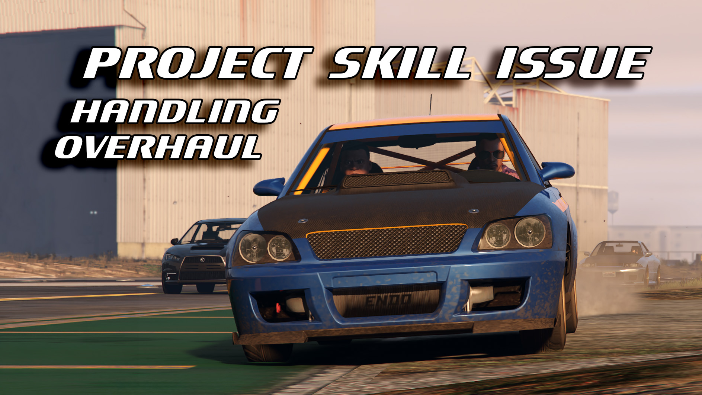

# "Project Skill Issue" handling overhaul

<a href="https://www.gta5-mods.com/vehicles/project-skill-issue"
   target="_blank"
   class="download-button"
   title="Download from GTA5-Mods.com">📥Releases</a>

An uncompromising handling pack, based on how cars feel through a wheel - how they *should* feel. Inspiration taken from hard driving in Assetto Corsa EVO and BeamNG, on and beyond the edge of traction. This pack provides handling and script configurations for a complete ground vehicle roster, suitable for driving with a wheel, with all vehicles getting a representative feel through both handling and drivetrain performance accuracy.

Hop into the Omnis and experience the panic of a Group B turbo kicking your teeth in. Fly through the LS canyons with the high revving RT3000. Lament traffic in your Asea. Leave traffic in the dust with your electric Coil Raiden.

Features:

* Handling adjusted for all road-going vehicles, including all DLC, including the latest The Kortz Center Heist vehicles
* Power unit overhaul: Uses handling drive force and drag, combined with CustomTorqueMap and TurboFix configurations for a representative way that various different engines build power, and works for NA, Turbo, Supercharged and EV vehicles.
* Transmission: Uses Custom Gear Ratios for representative final drive and gearing ratios, number of gears and even CVT simulation for select vehicles. Combines with power unit overhaul for a realistic way to reach top speeds.
* General tire physics: Realistic traction values while maintaining and even increasing responsivity, removal of unrealistic low-speed traction loss, allow tire deformation
* Chassis and weight transfer overhaul: Uses inertia, suspension and traction balance changes to allow weight transfer, keeps vehicle responsive despite realistically low grip values for the tires
* Braking bias correction to reduce unrealistic rear-wheel brake locking, disable ABS for appropriate vehicles
* Drive bias corrections to mirror real-life counterpart drivetrains
* This *IS* an uncompromising handling pack, primarily geared for steering wheels, but it should still feel good and playable on a gamepad. However: No more near-infinite grip - this means that you do need to slow down for turns!

## Requirements

* Grand Theft Auto V (Legacy/Enhanced)
* [Custom Torque Map](https://www.gta5-mods.com/scripts/custom-torque-map){:target="_blank"} 1.3.0 or newer
* [Custom Gear Ratios](https://www.gta5-mods.com/scripts/custom-gear-ratios){:target="_blank"} 2.2.0 or newer
* [TurboFix](https://www.gta5-mods.com/scripts/turbofix-2){:target="_blank"} 2.6.0 or newer

Optional:

* [Manual Transmission](https://www.patreon.com/ikt){:target="_blank"} 5.9.0 or newer - Custom automatic gearbox presets.
* [InversePower](https://www.gta5-mods.com/scripts/inversepower){:target="_blank"}

## Installation

* Included handling.meta replaces `{game folder}/mods/update/update.rpf/common/data/handling.meta`
* Included materials.dat replaces `{game folder}/mods/update/update.rpf/common/data/materials/materials.dat`
* The four folders ManualTransmission, CustomGearRatios, CustomTorqueMap and TurboFix can all be dropped into the `{game folder}`.

## Development info

AI Transparency: This was developed using AI assistance for analysis and repetitive/boilerplate work. A lot of validation
was done, but I couldn't have cooked up hundreds of entries from scratch.

The changes applied to the whole vehicle roster are based on several archetypes, based on vanilla handling values. Some cars have explicitly researched drivetrain values and handling tuning, but most cars follow an archetype based on what Rockstar gave them for vanilla handling.

As it happens with bulk stuff: Some vehicles may not be represented truthfully, if there are major disconnects with their real-life counterpart, **please let me know**. Specifically: Let me know which model/handling is affected, which real-life car it should be according to you, and what the problem is.

During development, vehicles had to be matched up against their (probably) real-life counterpart. For that, [GTA Wiki](https://gta.wiki/) was used for community consensus about which real-life counterpart each vanilla vehicle roughly matched up to.

Find the reference list here: [Vehicle reference list](5-handling-pack-vehref).
