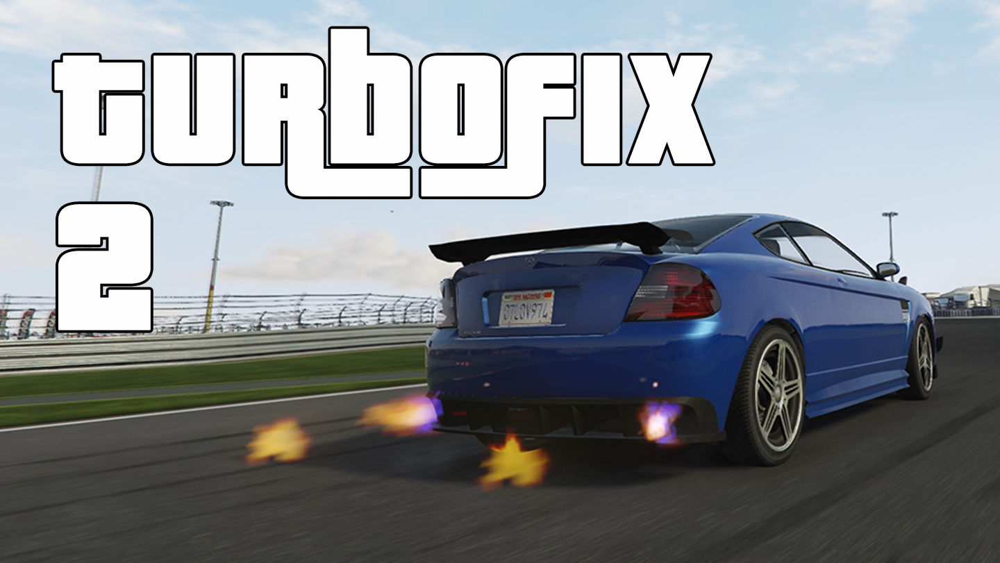

# TurboFix
{:.no_toc}

Overhauls how the turbo works, for more useful performance and new effects.

<a href="https://www.gta5-mods.com/scripts/turbofix-2"
   target="_blank"
   class="download-button"
   title="Download from GTA5-Mods.com">📥Releases</a>

* ToC Placeholder
{:toc}

## Features

* Unlock turbo boost limits  
  The original turbo only adds 10% torque when fully spooled up.  
  This script unlocks that for much more boost and resulting power!  
* Better turbo spooling  
  The original turbo takes a very long time to spool up to full boost.  
  This script makes it to spool up as quickly as your configuration allows, for realistic turbo lag.  
* Anti-lag and effects  
  Optionally simulate anti-lag by keeping boost high off-throttle.  
  Optionally play visual and audio effects while anti-lag is active!  
  Works best combined with Manual Transmission  
* Supports NPC vehicles  
  Combines great with ARS by Eddlm for competitive AI performance  
* Turbo dial adjustments with DashHook  
  Vehicles' turbo dials are remappable to accurately show boost  

## Requirements

* Grand Theft Auto V
* [ScriptHookV](http://www.dev-c.com/gtav/scripthookv/)

Optional:

* [DashHook](https://www.gta5-mods.com/tools/dashhook)
* [Manual Transmission](https://github.com/ikt32/scripts-updates/blob/master/5-gears-readme.md)

## Installation

1. Drag and drop the following files into your GTA V folder.
   1. `TurboFix.asi`
   2. `TurboFix` folder
   3. `irrKlang.dll`
2. In-game: Immediately works for all cars with the turbo tuning upgrade installed
3. In-game: Use `turbofix` cheat to open the menu (see "Menu opening")
   1. Menu can be used to view, customize and save configurations

## Menu opening

1. Open the cheat box with tilde key (~)
2. Enter the "turbofix" cheat without quotes

The menu opening cheat and other shortcuts may be changed in `settings_menu.ini`.
Usable buttons are in `Keys_Controls.txt`.

## Creating configs from scratch

Configs can be manually made when not using the in-game menu, check `TurboFix/Configs/INSTRUCTIONS.txt` for info.

### Configuration file layout

Section **ID**

* `ModelHash` - Vehicle model hash this config should automatically apply to.
* `ModelName` - Vehicle model name used to identify the vehicle and derive its model hash.
* `Plate` - License plate this config should match for a specific vehicle.
* `Models` - Legacy option containing one or more vehicle model names; only the first is used.
* `Plates` - Legacy option containing one or more license plates; only the first is used.

If no model is specified, the config is generic and will not automatically be associated with a vehicle.

Section **Turbo**

* `ForceTurbo` - Automatically installs the turbo upgrade when the config is loaded.
* `RPMSpoolStart` - Relative RPM at which the turbo starts building boost.
* `RPMSpoolEnd` - Relative RPM at which the turbo can reach maximum boost.
* `MinBoost` - Maximum vacuum value used when the turbo is not producing boost.
* `MaxBoost` - Maximum boost value, where `1.0` adds 10% engine power.
* `SpoolRate` - Controls how quickly boost rises toward its target value. `0.9` means it reaches 90% of its target boost after 1 second. `0.999` means almost instant.
* `UnspoolRate` - Controls how quickly boost falls when the turbo is no longer being driven.
* `FalloffRPM` - Relative RPM above which boost starts dropping toward redline.
* `FalloffBoost` - Boost level reached at redline when boost falloff is enabled.
* `BoostCurve` - Controls how boost builds between RPMSpoolStart and RPMSpoolEnd. `1.0` - linear. Less than `1.0` bring boost in harder earlier. Above `1.0` exponential boost as RPM rises.

RPM values are normalized, with `1.0` representing the rev limit; boost falloff is only active when `FalloffRPM` is higher than `RPMSpoolEnd`.

Section **BoostByGear**

* `Enable` - Enables per-gear boost limiting.
* `1-10` - Defines maximum boost allowed in specified gear.

Only the configured gear entries are used, up to a maximum of 10 gears. Every used gear needs to be present.

Section **AntiLag**

* `Enable` - Keeps the turbo spooled while off-throttle at sufficiently high RPM.
* `MinRPM` - Minimum RPM fraction at which anti-lag becomes active.
* `Effects` - Enables anti-lag exhaust pops, bangs, flames, and sound effects.
* `PeriodMs` - Minimum delay in milliseconds between anti-lag effects.
* `RandomMs` - Adds a random delay of up to this many milliseconds between anti-lag effects.
* `LoudOffThrottle` - Continues producing the louder pops and bangs after the initial throttle lift.
* `LoudOffThrottleIntervalMs` - Minimum interval in milliseconds between loud off-throttle effects.
* `SoundSet` - Selects the sound set used for anti-lag effects, such as `Default` or `NoSound`.
* `Volume` - Controls the volume of anti-lag sound effects.

Section **Dial**

* `BoostOffset` - Adds an offset to the boost value sent to the dashboard boost gauge.
* `BoostScale` - Scales the boost value sent to the dashboard boost gauge.
* `VacuumOffset` - Adds an offset to the vacuum value sent to the dashboard gauge.
* `VacuumScale` - Scales the vacuum value sent to the dashboard gauge.
* `BoostIncludesVacuum` - Maps vacuum onto the boost gauge as well, for combined vacuum/boost gauges.

TurboFix may use [DashHook](https://www.gta5-mods.com/tools/dashhook){:target="_blank"}
on vehicles with a boost gauge, to change its behavior to better match what the turbo is doing.

### Combining with `fInitialDriveForce`

You can combine a lower `fInitialDriveForce` in the vehicle's handling with a TurboFix config to split the car's power delivery into **base engine output** and **turbo-added output**: lower `fInitialDriveForce` until the naturally aspirated/off-boost power/torque represents the grunt you want the engine itself to make, then use `MaxBoost`, `RPMSpoolStart`, `RPMSpoolEnd`, and `SpoolRate` to add the remaining performance progressively as the turbo comes on boost. This can make a turbocharged engine feel much less like it has its full torque everywhere and give it a clearer transition from off-boost performance into its boosted power band.

### Base config

`TurboFix/TurboFixBase.ini` is a separate, read-only base layer intended for vehicle and handling packs. It can contain defaults for many vehicle models.
Configs in this directory override matching TurboFixBase entries, so updating a pack cannot overwrite user customization. See TurboFixBase.ini for its
monolithic file format. In-game changes to a base entry must be stored with a "Save as" option, which creates an editable config in the directory.
Browse the base entries under Settings > View base config; both config lists are searchable.

## Adding sounds

Sound sets can be added by creating a new folder in the Sounds folder. Files need to be of type `.wav`.

Files inside the new folder should be named:

* `EX_POP_0.wav`
* `EX_POP_(number).wav`
* `EX_POP_SUB.wav`

For example, to get 16 sounds playing, name your files `EX_POP_0.wav` through `EX_POP_15.wav`.

The script randomly picks a numbered exhaust sound. `EX_POP_SUB.wav` always plays.

## Developers

In the release archive, in `TurboFix/Developers`, the current header with exposed TurboFix functions is available.

This can be used to retrieve the mod status and applicable boost information.

## Credits

* Audio for anti-lag by Dieguuuds
