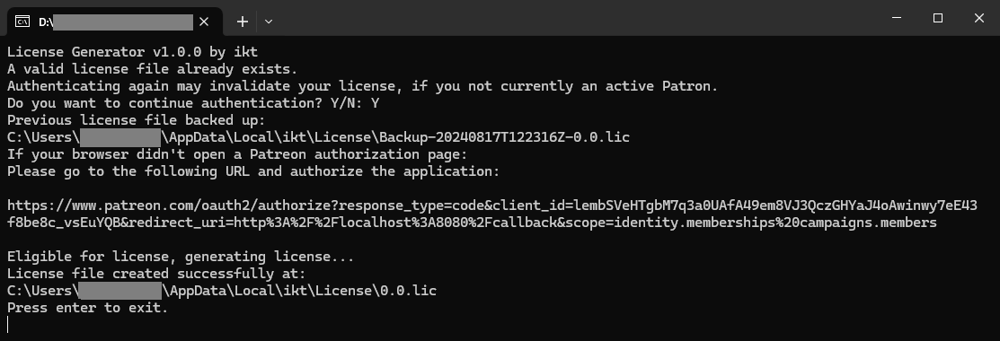

# ikt's scripts

This repository hosts metadata for script updates, and the downloads are in the [Releases](https://github.com/ikt32/scripts-updates/releases) section.

Scripts released here are only usable after activation through [Patreon](https://www.patreon.com/ikt).

<table align="center">
  <tr>
    <td align="center">
      <!-- Placeholder -->
    </td>
    <td align="center">
      <a href="licgen-readme">
        
         
        License Generator
         
        1.1.0
      </a>
    </td>
    <td align="center">
      <!-- Placeholder -->
    </td>
  </tr>
  <tr>
    <td align="center">
      <a href="5-gears-readme">
        
         
        Manual Transmission
         
        5.6.3
      </a>
    </td>
    <td align="center">
      <a href="5-cgr-readme">
        
         
        Custom Gear Ratios
         
        1.2.2
      </a>
    </td>
    <td align="center">
      <a href="5-turbofix-readme">
        
         
        TurboFix
         
        2.4.0
      </a>
    </td>
  </tr>
</table>

## Links

* Manual Transmission for GTA V
  * [Releases](https://github.com/ikt32/scripts-updates/releases?q=%22Manual+Transmission%22)
  * [Readme](./5-gears-readme.md)
  * [Changelog](./5-gears-changelog.md)
* Custom Gear Ratios for GTA V
  * [Releases](https://github.com/ikt32/scripts-updates/releases?q=%22Custom+Gear+Ratios%22)
  * [Readme](./5-cgr-readme.md)
  * [Changelog](./5-cgr-changelog.md)
* TurboFix for GTA V
  * [Releases](https://github.com/ikt32/scripts-updates/releases?q=%22TurboFix%22) 
  * [Readme](./5-turbofix-readme.md)
  * [Changelog](./5-turbofix-changelog.md)
