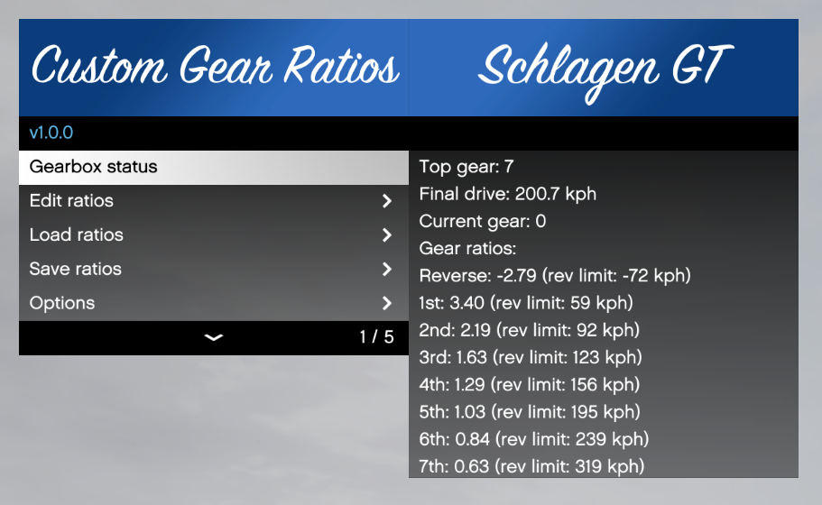
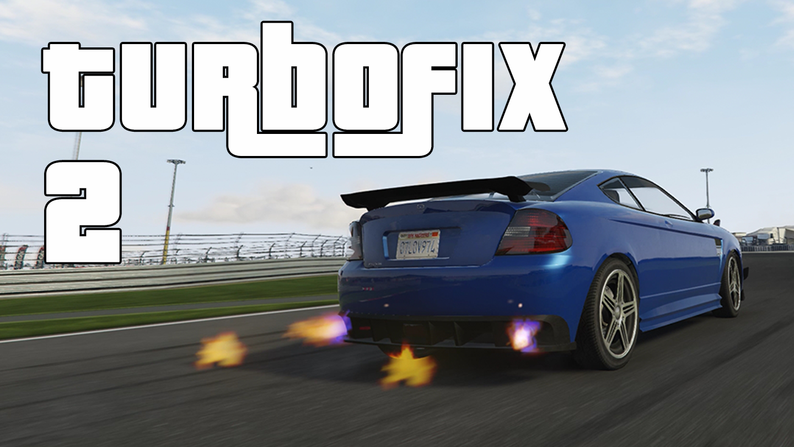

# Driving Realism Enhancements

This collection of Patreon-supported scripts aims to extend the limits of vehicle
simulation in Grand Theft Auto V to bring a close-to-sim level of realism into the game.

## [Manual Transmission](5-gears-readme)

[{:width="480"}](5-gears-readme) 
[`📥 Releases`](https://github.com/ikt32/scripts-updates/releases?q=%22Manual+Transmission%22){:target="_blank"}
[`📖 Description`](5-gears-readme)
[`🛠️ Changelog`](5-gears-changelog)

Expands the driving immersion and experience with:

* wheel support with force feedback
* manual transmission simulation
* custom automatic transmission simulation
* advanced steering settings
* more steering wheel range
* realistic and configurable assists
* and much more

## [Custom Gear Ratios](5-cgr-readme)

[{:width="480"}](5-gears-readme) 
[`📥 Releases`](https://github.com/ikt32/scripts-updates/releases?q=%22Custom+Gear+Ratios%22){:target="_blank"}
[`📖 Description`](5-cgr-readme)
[`🛠️ Changelog`](5-cgr-changelog)

Create custom gearbox ratios for vehicles to match their real world counterparts.

## [TurboFix](5-turbofix-readme)

[{:width="480"}](5-turbofix-readme) 
[`📥 Releases`](https://github.com/ikt32/scripts-updates/releases?q=%22TurboFix%22){:target="_blank"}
[`📖 Description`](5-turbofix-readme)
[`🛠️ Changelog`](5-turbofix-changelog)

Overhauls and fixes turbo behavior in the game:

* fix turbo spool-up speed
* unlock boost
* anti-lag
* anti-lag effects

## [Custom Torque Map](5-ctm-readme)

[{:width="480"}](5-ctm-readme) 
[`📥 Releases`](https://github.com/ikt32/scripts-updates/releases?q=%22Custom+Torque+Map%22){:target="_blank"}
[`📖 Description`](5-ctm-readme)
[`🛠️ Changelog`](5-ctm-changelog)

Apply engine torque curve profiles to simulate the engine power throughout
the rev range, and visualize the results. Also includes a unique Nissan 300ZX
inspired tachometer incorporating the power curve.

## [License](licgen-readme)

[ `Patreon`](https://www.patreon.com/ikt){:target="_blank"}
[`📥 Download`](https://www.patreon.com/c/ikt/membership){:target="_blank"}
[`📖 Description`](licgen-readme)

The new versions of the scripts featured here only work after getting this license.
If you'd like to check out my prior work, click on the GTA5-Mods button above.
This license scheme allows me to spend time to continue work on these scripts.
