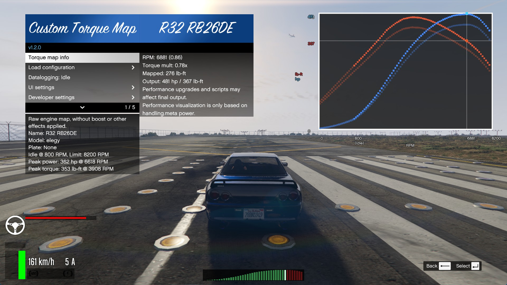

<h1 style="display:none;">{{site.title}}</h1>

## [Access and License Generator](licgen-readme)

[`📖 README`](licgen-readme)
[`📥 Download`](https://www.patreon.com/c/ikt/membership){:target="_blank"}
[ `Patreon`](https://www.patreon.com/ikt){:target="_blank"}

Access to the scripts listed on this page is managed by a license system.
[Subscribing to my Patreon](https://www.patreon.com/ikt){:target="_blank"} allows you
to generate a *unique license for your system*, which grants access to use these scripts. Please
check the [detailed manual of License Generator](licgen-readme){:target="_blank"}.
It explains what it is, how you use it, and what you can expect.

## [Manual Transmission](5-gears-readme)

[{:width="480"}](5-gears-readme) 
[`📖 README`](5-gears-readme)
[`📥 Releases`](https://github.com/ikt32/scripts-updates/releases?q=%22Manual+Transmission%22){:target="_blank"}
[`🛠️ Changelog`](5-gears-changelog)

Expands the driving immersion and experience with:

* wheel support with force feedback
* manual transmission simulation
* custom automatic transmission simulation
* advanced steering settings
* more steering wheel range
* realistic and configurable assists
* and much more

## [Custom Gear Ratios](5-cgr-readme)

[{:width="480"}](5-gears-readme) 
[`📖 README`](5-cgr-readme)
[`📥 Releases`](https://github.com/ikt32/scripts-updates/releases?q=%22Custom+Gear+Ratios%22){:target="_blank"}
[`🛠️ Changelog`](5-cgr-changelog)

Create custom gearbox ratios for vehicles to match their real world counterparts.

## [TurboFix](5-turbofix-readme)

[{:width="480"}](5-turbofix-readme) 
[`📖 README`](5-turbofix-readme)
[`📥 Releases`](https://github.com/ikt32/scripts-updates/releases?q=%22TurboFix%22){:target="_blank"}
[`🛠️ Changelog`](5-turbofix-changelog)

Overhauls and fixes turbo behavior in the game:

* fix turbo spool-up speed
* unlock boost
* anti-lag
* anti-lag effects

## [Custom Torque Map](5-ctm-readme)

[{:width="480"}](5-ctm-readme) 
[`📖 README`](5-ctm-readme)
[`📥 Releases`](https://github.com/ikt32/scripts-updates/releases?q=%22Custom+Torque+Map%22){:target="_blank"}
[`🛠️ Changelog`](5-ctm-changelog)

Apply engine torque curve profiles to simulate the engine power throughout
the rev range, and visualize the results. Also includes a unique Nissan 300ZX
inspired tachometer incorporating the power curve.

## More content

My other content is freely available from [GTA5-Mods.com](https://www.gta5-mods.com/users/ikt){:target="_blank"}.

Older releases of Patreon-published scripts are listed as releases
[in the repository on GitHub](https://www.github.com/ikt32/scripts-updates/releases){:target="_blank"}.
