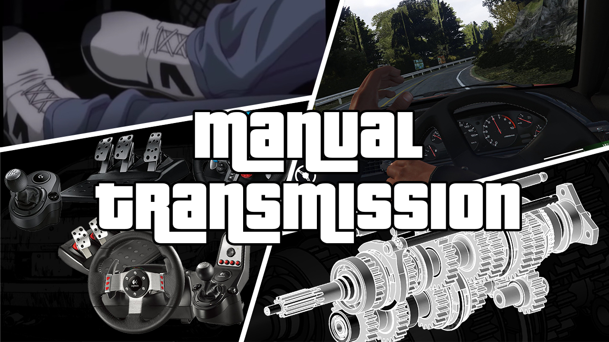
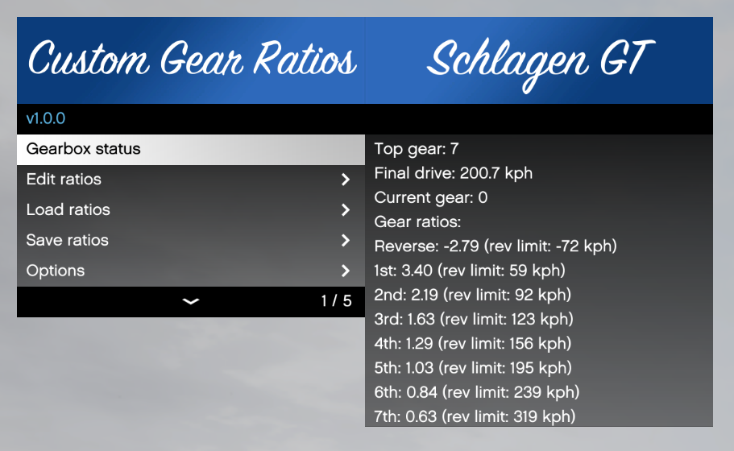
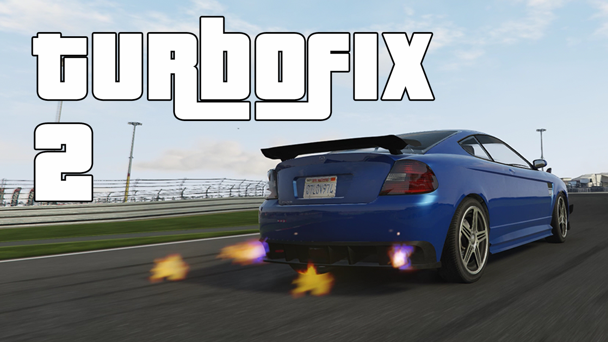
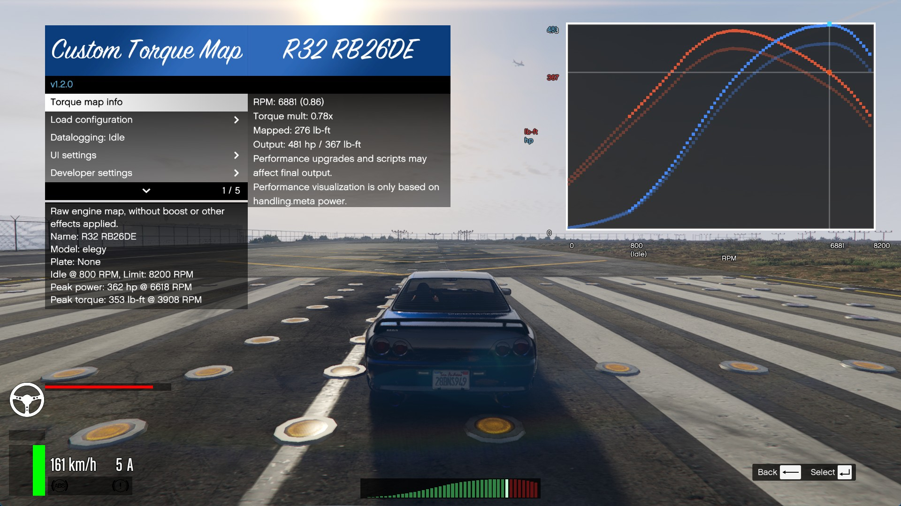

<h1 style="display:none;">{{site.title}}</h1>

## Resources

* [Frequently Asked Questions](faq) 
  Information about how this works, basic troubleshooting and other commonly asked questions.
* [Handling guide](handling-guide) 
  Handling setup tips for realistic vehicles. Especially useful to create handlings that feel good through force feedback.

## [Access and License Generator](licgen-readme)

[`📖 README`](licgen-readme)
[`📥 Download`](https://www.patreon.com/c/ikt/membership){:target="_blank"}
[ `Patreon`](https://www.patreon.com/ikt){:target="_blank"}

[You can support me by subscribing to my Patreon.](https://www.patreon.com/ikt){:target="_blank"}
Doing so grants you access to my steering wheel support software (WIP),
which my game plugins can use to expand functionality and peripheral support of said plugins.

While subscribed and eligible, License Generator generates a *unique license for your system*,
which enables the wheel support software.
Please check the [detailed manual of License Generator](licgen-readme){:target="_blank"}.
It explains what it is, how you use it, and what you can expect.

**Important note**: At the time of writing (2026-01-20), the project is in a transitional maintenance phase while these
changes are implemented. Steering wheel support currently is *not* accessible yet.

Other perks of being a Patron are:

* Early Access to select vehicle-related scripts
  * Manual Transmission
  * TurboFix
  * Custom Torque Map
  * Custom Gear Ratios
* Discord role and active support

## [Wheel Support](wheel-support-readme)

Hardware support module. May be used by supported plugins to add peripheral support.

WIP

## [Manual Transmission](5-gears-readme)

[{:width="480"}](5-gears-readme) 
[`📖 README`](5-gears-readme)
[`📥 Releases`](https://github.com/ikt32/scripts-updates/releases?q=%22Manual+Transmission%22){:target="_blank"}
[`🛠️ Changelog`](5-gears-changelog)

Expands the driving immersion and experience with:

* wheel support with force feedback
* manual transmission simulation
* custom automatic transmission simulation
* advanced steering settings
* more steering wheel range
* realistic and configurable assists
* and much more

## [Custom Gear Ratios](5-cgr-readme)

[{:width="480"}](5-gears-readme) 
[`📖 README`](5-cgr-readme)
[`📥 Releases`](https://github.com/ikt32/scripts-updates/releases?q=%22Custom+Gear+Ratios%22){:target="_blank"}
[`🛠️ Changelog`](5-cgr-changelog)

Create custom gearbox ratios for vehicles to match their real world counterparts.

## [TurboFix](5-turbofix-readme)

[{:width="480"}](5-turbofix-readme) 
[`📖 README`](5-turbofix-readme)
[`📥 Releases`](https://github.com/ikt32/scripts-updates/releases?q=%22TurboFix%22){:target="_blank"}
[`🛠️ Changelog`](5-turbofix-changelog)

Overhauls and fixes turbo behavior in the game:

* fix turbo spool-up speed
* unlock boost
* anti-lag
* anti-lag effects

## [Custom Torque Map](5-ctm-readme)

[{:width="480"}](5-ctm-readme) 
[`📖 README`](5-ctm-readme)
[`📥 Releases`](https://github.com/ikt32/scripts-updates/releases?q=%22Custom+Torque+Map%22){:target="_blank"}
[`🛠️ Changelog`](5-ctm-changelog)

Apply engine torque curve profiles to simulate the engine power throughout
the rev range, and visualize the results. Also includes a unique Nissan 300ZX
inspired tachometer incorporating the power curve.

## More content

My other content is freely available from [GTA5-Mods.com](https://www.gta5-mods.com/users/ikt){:target="_blank"}.

An archive of older releases of Patreon-published scripts are available
[in the repository on GitHub](https://www.github.com/ikt32/scripts-updates/releases){:target="_blank"}.
