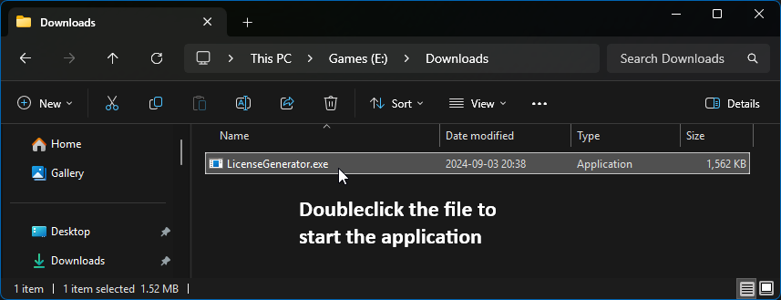
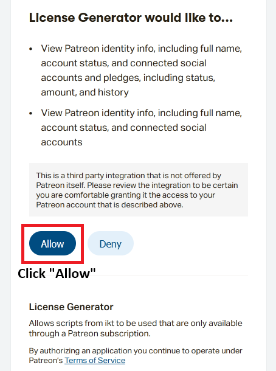
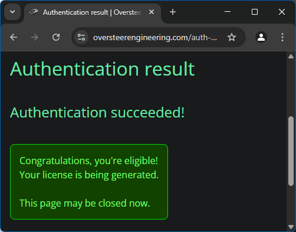
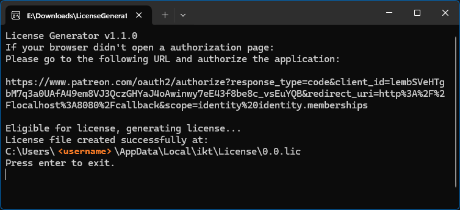

# License Generator

License Generator enables usage of (select) scripts by ikt. It checks if you are eligible for a license
through Patreon. If you are, it generates a unique license for your system.

Scripts that use this license will automatically detect and use it.

## Features

* Unrestricted number of activations on any number of systems as long as eligible[[1]](#notes-1)
* License stays forever valid for *activated system configuration*[[2]](#notes-2)
* Scripts are 100% offline regarding license: everything stays on your system[[3]](#notes-3)[[4]](#notes-4)

Check the [Notes section](#notes) for more information.

## Download

The License Generator tool is only available and applicable for Patrons.

The latest License Generator is always linked in the welcome note on
[your Patreon membership page](https://www.patreon.com/c/ikt/membership){:target="_blank"}
for my campaign.

## Usage

Before you start:

* Make sure the game is closed.
* Make sure Patreon.com can be reached from your computer.
* [Make sure you have at least the "Supporter" tier](https://www.patreon.com/c/ikt/membership){:target="_blank"}.
* [Download the License Generator from the Patreon membership page](https://www.patreon.com/c/ikt/membership){:target="_blank"}.
  `LicenseGenerator.exe` can be placed anywhere you want.

### 1: Starting the application

Start `LicenseGenerator.exe`. It opens a command prompt with instructions and also opens a browser window

  
  

If a license is already detected, you must type `Y` to overwrite it, or `N` to close the license generator.

### 2: Authorizing License Generator on Patreon

Authorize the License Generator in Patreon, in the opened browser window.
If the window does not open or if you are logged into an eligible Patreon account in a different browser,
the URL in the browser or in the command prompt can be copied and pasted into another browser.

  

### 3: Finalizing

The license generator is now finished and can be closed.

License Generator creates the license file at `%localappdata%\ikt\License\`.
**You don't need to do anything with this file**: scripts that use it
automatically read the license.

The game can now be started with the scripts automatically activated.

  
  

## Troubleshooting

Check the [FAQ](faq#license-generator-troubleshooting){:target="_blank"} for
things you can try if any issue occurs.

If you're still experiencing issues, please [let me know through Discord](contact).

Please DM me from `%localappdata%\ikt\License\`, the following files

* `LicenseGenerator.log`
* `0.0.lic` (or any other `.lic` file)
* And logs from the affected script (e.g. `Gears.log`).

### Backups

After generating the license and making sure it works, it's a good idea to back up your
license in case you're factory resetting your computer, or wipe the drive that stores
your localappdata.

The license should be generated in `%localappdata%\ikt\License\` and it can be restored to
the same location. After restoring the license file, scripts should pick it up and be
activated again automatically.

If no backups are made, re-subscribing is necessary to generate a new license.

## Notes

1. 
   You're eligible when you have an active pledge with the account that authorizes License Generator.
2. 
   Swapping out multiple core components may cause the system to be expired for the license.
   Re-generation of the license is needed in this situation.
3. 
   Only the License Generator connects with Patreon to check if you are eligible.
   The scripts only check the license file locally.
   The scripts themselves may or may not individually check select GitHub repositories to notify for
   updates or to pull in data required for the script to work.
4. 
   The License Generator **must** be able to connect with Patreon to verify you're eligible.
   Make sure your computer has access to Patreon.com.

## Terms of Use

This Software Use Agreement ("Agreement") is between ikt ("Author") and the User (the subscriber who uses the services). By subscribing to the Author’s Patreon and using the software described below, the User agrees to these terms.

### 1. License to use the software

* **Non-commercial Nature of Projects:**\
  By subscribing to the Author's Patreon, the User is granted access to the Author's personal, non-commercial projects. These projects are provided as a gesture of gratitude for supporting the Author’s creative efforts. This Agreement does not represent a commercial transaction, and the Software is not offered as a product for sale. The subscription is solely for supporting the Author’s work, and in return, the User is provided access to the Author’s projects, which are presented as-is, without any commercial guarantee or obligation.

* **Grant of License:**\
  While subscribed to the Author's Patreon, the User is granted a non-exclusive, non-transferable right to use the License Generator to create license files ("License") for the Author's software ("Software"). This License permits the User to use the Software on multiple machines, provided that each License is tied to the specific system configuration at the time of creation.

* **License Restrictions:**\
  The License generated by the License Generator is linked to the specific hardware and system configuration of the machine where it was created. If the configuration changes significantly, the License will become invalid, and a new License must be generated. To generate a new License, the User must be actively subscribed to the Author’s Patreon. Licenses cannot be transferred between machines, and the User is prohibited from modifying, reverse-engineering, or redistributing the Software, License Generator, or License.

* **Affiliation Disclaimer:**\
  The Software is an independent creation and is not affiliated with, endorsed by, or associated in any way with the original developers of the applicable games. All content within this Software is the work of the Author and does not represent the views or work of Original Developer. All trademarks and copyrights are the property of their respective owners.

### 2. Subscription terms

* **Access to License Generator:**\
  The User can generate licenses only while they are subscribed to the Author's Patreon campaign. If the subscription is canceled, the User will no longer be able to generate new licenses, but any licenses already created will still work on their machine.

* **Post-Subscription Access:**\
  If the User cancels their Patreon subscription, they will no longer be eligible to generate new licenses. However, any licenses already created will remain valid on the original machine, unless the machine's configuration changes significantly.

### 3. As-is disclaimer

* **No Warranty:**\
  The Software and License Generator are provided "as is," with no warranties of any kind. The Author makes no promises about the performance or availability of the Software or License Generator.

* **No Support Obligation:**\
  The Author has no obligation to provide technical support, updates, or fixes for the Software, License Generator, or License. The User is responsible for maintaining their system and ensuring it works with the Software.

  The Software may be rendered incompatible by updates to applicable games. The Author is under no obligation to provide updates to the Software to compatible with game updates. The User is responsible for creating and restoring backups if they wish to proceed using the Authors' Software after a game is pushed.

* **Platform Compatibility:**\
  The Software and License Generator are designed for x86, 64-bit Windows PCs. The Author makes no guarantees that the Software or License Generator will work on other platforms (e.g., ARM, Linux, macOS, emulators, or compatibility layers like WINE).

* **No Support for Non-Windows Systems:**\
  The Author does not provide support for issues arising from using the Software or License Generator on platforms other than Windows. Any attempts to use them on other platforms are at the User's own risk.

* **No Endorsement for Online Use:**\
  The Software and any associated modifications are intended solely for use in the single-player mode of Grand Theft Auto V ("GTA V"). The Author does not endorse or support the use of these modifications in GTA: Online. The Author explicitly discourages the use of these modifications in GTA: Online, and any attempt to use them in online modes could result in penalties from Rockstar Games, including but not limited to account suspension or banning. The Author will not answer any questions or provide support related to using modifications in GTA: Online or with third-party multiplayer mods.

### 4. Availability and online reliance

* **Reliance on Third-Party Services:**\
  The License Generator relies entirely on the Patreon API to check the User’s subscription status and generate licenses. The Author cannot guarantee the availability or reliability of the Patreon API. The User is responsible for ensuring they can access Patreon services normally. Using tools like VPNs or proxies may interfere with the License Generator, and the Author is not responsible if these tools prevent communication with Patreon.

* **Connection Issues:**\
  The Author is not responsible for issues caused by an inability to connect to the Patreon API, including network disruptions, Patreon outages, or the User's use of VPNs, proxies, or similar tools.

### 5. Limitations of liability

* **No Liability for Damages:**\
  Under no circumstances will the Author be liable for any direct, indirect, or incidental damages that result from the use or inability to use the Software, License Generator, or License, including damage to hardware, loss of data, or software conflicts.

* **Indemnification:**\
  The User agrees to defend and hold the Author harmless against any claims, damages, or liabilities resulting from misuse of the Software, License Generator, or License.

### 6. Intellectual property rights

* **Ownership:**\
  The Software, License Generator, and all related intellectual property rights belong to the Author. The User’s subscription gives them a limited, non-exclusive right to use the License Generator and create Licenses, but no ownership is transferred.

### 7. Termination

* **Termination of Access:**\
  If the User violates the terms of this Agreement or cancels their subscription, they will no longer be eligible to generate new licenses. However, any licenses already created will remain valid, provided the machine’s configuration remains unchanged. Access to the Author’s personal projects and the License Generator is a privilege extended during the subscription period.

### 8. Renewal of licenses due to system configuration changes

* **License Renewal Requirement:**\
  If a machine’s system configuration changes significantly and the License stops working, the User must be subscribed to the Author’s Patreon to generate a new License. Licenses will not renew automatically, and the User must ensure they are subscribed when renewing a License.

* **Upgraded License Requirements for New Versions:**\
  The Author may release new software or updated versions of existing software that require a different or upgraded license to function. Users must generate a new license using the updated License Generator while subscribed to the Author's Patreon in order to use these new versions. This new license does not invalidate the old license; both the new and old licenses can exist together, allowing the User to continue using software activated with a previous version of the license alongside updated versions.

### 9. Refunds and cancellation

* **Refunds:**\
  Refunds to pledges may be issued in case of exceptional circumstances, at the discretion of the Author. Refunds may not be issued in the following cases:
  * Failure to acknowledge the general usage and subscription terms described in sections 1, 2 and 7.
  * Failure to acknowledge the technical restrictions regarding License Generator requirements described sections 3, 4 and 5.
  * Any misunderstanding in the nature of software requiring this License.
  * Any incompatibility issue while using software requiring this License.
  * Use of the license for evaluation purposes of the software requiring this License.
  * Refunds requested after an unreasonably long time (more than 1 month ago). Refunds requested after Patreon's 3 month refund window will not be issued.
  * Violation of the code of conduct set out in the "rules" channel in the Author's Discord server, or other unacceptable behavior through other channels.

  Refunds are issued within the constraints of [Patreon's Relationship manager](https://support.patreon.com/hc/en-us/articles/115001243446-How-do-I-refund-my-members-and-customers), no refunds are issued outside of Patreon.

### 10. Modifications to this agreement

* **Right to Modify:**\
  The Author reserves the right to modify this Agreement at any time. Changes to this license may be tracked through [the commit history for this file](https://github.com/ikt32/scripts-updates/commits/master/licgen-readme.md).
